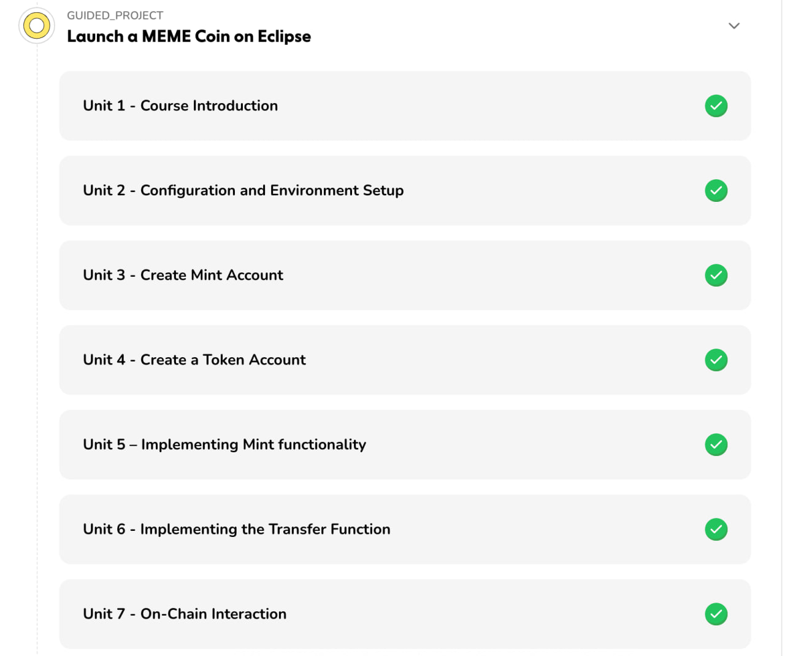

# Launch a MEME Coin on Eclipse

This project is part of the "Launch a MEME Coin on Eclipse" guided challenge in HackQuest. It demonstrates how to create and manage a Solana-based token using the Eclipse testnet.



## Overview

The project includes the following steps:
1. **Create a Mint Account**: Initialize a new token mint with specified decimals.
2. **Create Associated Token Accounts (ATA)**: Generate token accounts for users.
3. **Mint Tokens**: Mint tokens to the associated token account.
4. **Transfer Tokens**: Transfer tokens between accounts.

## Prerequisites

- Node.js installed on your system.
- Basic knowledge of JavaScript and Solana blockchain.
- Access to the Eclipse testnet.

## Setup

1. Clone this repository:
   ```bash
   git clone <repository-url>
   cd my-spl-token
   ```

2. Install dependencies:
   ```bash
   npm install
   ```

3. Update the `index.js` file with your own secret keys and public keys if needed.

## Usage

Run the script to execute the token creation and transfer process:
```bash
node index.js
```

## Key Features

- **Mint Creation**: Create a new token mint with customizable decimals.
- **Token Account Management**: Automatically create associated token accounts for users.
- **Token Minting**: Mint tokens to a specified account.
- **Token Transfer**: Transfer tokens securely between accounts.

## Dependencies

This project uses the following libraries:
- `@solana/web3.js`: For interacting with the Solana blockchain.
- `@solana/spl-token`: For managing SPL tokens.
- `bs58`: For encoding and decoding keys.

## Resources

- [Eclipse Network Documentation](https://eclipsenetwork.xyz/docs)
- [Solana SPL Token Documentation](https://spl.solana.com/token)

## License

This project is licensed under the MIT License. See the LICENSE file for details.

---

Happy hacking with your MEME Coin on Eclipse!
